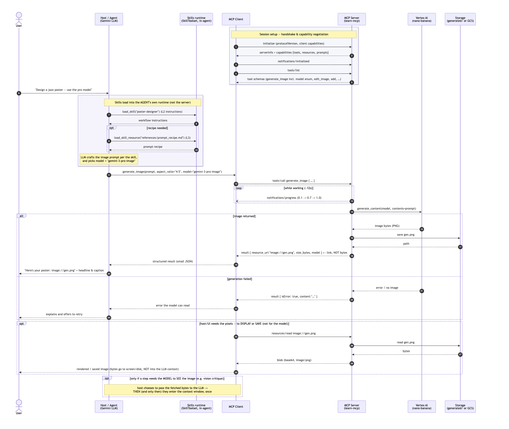

# learn-mcp — a hands-on Model Context Protocol project

An end-to-end MCP tutorial you can run: an **MCP server** wrapping a Google Gemini **image
model** (nano-banana), proven on the raw wire protocol, driven by a **Gemini ADK agent**, and
composed with **Agent Skills**. It demonstrates every MCP primitive — tools, resources, prompts,
progress, sampling, elicitation — plus both transports (stdio and Streamable HTTP), structured
output, and per-call model selection.

- **`THEORY.md`** — a complete, plain-English MCP reference (REST vs MCP vs Skills, the context
  economics, transports, auth, scaling).
- **`SEQUENCE.md`** — the end-to-end sequence diagram in Mermaid.

## Architecture (end-to-end)

An agent (with Skills) calls the MCP server, which calls the image model, saves the result, and
returns a *link* the client reads on demand:



Key idea: only a small `resource_uri` crosses back in the tool result — the image bytes travel to
the client **only on demand** (`resources/read`), and enter the model's context **only if the host
explicitly feeds them to the model**. That's what keeps the agent's context small.

## Layout
```
server/            FastMCP server: image tools (multi-model) + every MCP primitive
client/            raw_client.py (stdio, proves the protocol) · remote_client.py (hosted, HTTP)
adk_agent/         Gemini ADK agent over MCP; skills/ used by the demos
creative_studio/   ADK agent = 4 Skills (know-how) + MCP tools (capability)
assets/            diagrams
THEORY.md          complete MCP reference
SEQUENCE.md        Mermaid sequence diagram
```

## Prerequisites
- **[uv](https://docs.astral.sh/uv/)** and Python 3.11+
- **Google Cloud auth for Vertex** (the image model): `gcloud auth application-default login`, a
  project with Vertex AI enabled, then set env vars:
  `GOOGLE_CLOUD_PROJECT=<your-project>`, `GOOGLE_CLOUD_LOCATION=global` (default),
  `NANO_BANANA_MODEL=gemini-3.1-flash-image` (default). Each subproject has its own
  `pyproject.toml`; `uv` creates the venv on first run.

## Run it

**1. Server (stdio) + raw protocol client** — exercises every feature:
```bash
cd client && uv run --project ../server python raw_client.py
```

**2. Server over HTTP (Streamable HTTP):**
```bash
cd server && uv run python learn_mcp_server.py --http --port 9000
# in another shell (set MCP_URL for a remote server):
cd client && uv run --project ../server python remote_client.py
```

**3. Gemini ADK agent → MCP** (start the HTTP server first):
```bash
cd adk_agent && uv run python run_test.py
```

**4. Skills + MCP composed:**
```bash
cd adk_agent && uv run python skill_mcp_demo.py
```

**5. Chat UI (adk web) — both agents:**
```bash
uv run --project adk_agent adk web --host 0.0.0.0 --port 8080 --allow_origins="*" .
# open http://localhost:8080 → pick `adk_agent` or `creative_studio`
```

## Choosing / adding image models
The image tools take a `model` parameter typed as a `Literal`, so it appears as an **enum** in the
tool schema and the agent can pick (`gemini-3.1-flash-image` default, `gemini-3-pro-image`, …).
Add a model by adding one line to `ImageModel` in `server/learn_mcp_server.py`.

## Scaling notes
- Image generation is ~12s and MCP clients must allow enough timeout (ADK's default is 5s — the
  code sets `timeout=120`).
- For high concurrency, run the server **stateless** over Streamable HTTP
  (`FastMCP(stateless_http=True, json_response=True)`) so it autoscales like a normal web service
  (no per-agent persistent connection). Store artifacts in object storage and return links. The
  real bottleneck is usually **model quota**, not the server. See `THEORY.md` §11.
