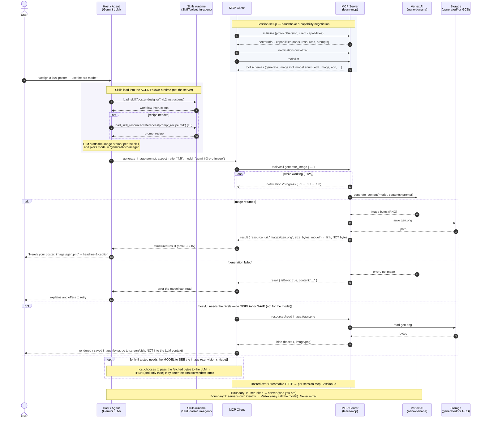

# learn-mcp — end-to-end sequence diagram

The full flow of a request through the system: an agent (with Skills) calling the MCP server,
which calls a Gemini image model, saves the result, and returns a link the client reads on
demand. Renders on GitHub, in VS Code (Mermaid preview), or at <https://mermaid.live>.

## Legend / notes
- **Solid arrow →** request; **dashed arrow ⇠** response; **open async arrow ⇢)** one-way
  notification (progress).
- **Skills run in the agent's runtime**, so `load_skill` / `load_skill_resource` never touch the
  MCP server — the Skill only decides *how*, then calls the MCP tool for the *what*.
- **Only a `resource_uri` crosses back** in the tool result (~100 tokens); the image bytes travel
  to the **client/host** only on demand via `resources/read`. Resources are *app-controlled*, so
  those bytes reach the **LLM's context only if the host explicitly feeds them to the model**
  (e.g. a vision step) — for display/save they never do. Inlining bytes in the tool result, by
  contrast, puts them in context on **every** call.
- **`model` is chosen per call** (enum in the tool schema); adding a model is a one-line change to
  the server's `ImageModel` Literal.
- **stdio vs HTTP:** over stdio there's no session id (one subprocess per client); over Streamable
  HTTP the server issues an `Mcp-Session-Id` and the two auth boundaries apply.
